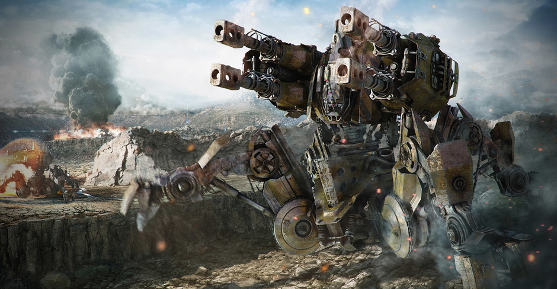

# 10. 微信已死

<time><em>2017-02-02</em></time> <em>微信</em>

> 1）任何在我出生时已经有的科技都是稀松平常的世界本来秩序的一部分。
> 2）任何在我15-35岁之间诞生的科技都是将会改变世界的革命性产物。
> 3）任何在我35岁之后诞生的科技都是违反自然规律要遭天谴的。
> 道格拉斯·亚当斯的科技三定律

把博客拆成更专注的几个主题然后移到 [GitBook](https://www.gitbook.com/@hbrls/dashboard) 上，回顾了一下之前的文章，发现简直是一部腾讯股票投资指南。实际上我也确实做到了两年翻倍，只可惜当时手头并没有更多的本金可以投入。不知道幸还是不幸的是，房价也翻倍了。

还欠着一篇 SNS（二）或（下），有一些收尾的东西想讲。关于腾讯的话题也基本结束了，可能还会欠一篇大文娱战略的，但从去年底面试阅文被拒开始，基本上和腾讯的缘分就结束了。30 岁了，会更专注一些，单点突破。

今天想讨论的话题是：如何预测未来。预测有很多方法，首先你可以看蜡烛图，一你要看市场的情绪，二你要看你的交易对手的情绪。你的对手是以月为周期或以季度为周期，同样的图表达出来的情绪可能是截然不同的。那么看蜡烛图的方法能提供的最远预测可以到哪里呢，考虑一个典型的风投，他希望 3-5 年就能退出，而蜡烛图应该是比这个期望要低一个数量级的，那么我们可以合理的估计其能提供的最远预测不超过 1 年。

其次你可以看风口。让我们回头看，如果你踩到了新闻门户的风口，比如新浪，如果你踩到了 SNS 的风口，比如人人，如果你踩到了 O2O 的风口，比如饿了么。又比如稍小一点的，友盟，美图秀秀，摩拜单车，不再一一举例了，你应该明白我在说什么，未来如果有空的话可能重新仔细琢磨下这些例子有没有代表性。当你看风口的时候，你的视野就和投 AB 轮的风投差不多了，大概在 3-5 年这个样子。同时，看风口也基本等同于看政策，看市场大环境，看整个时间轴上，目前的人类社会的经济、文化、科技水平所处的位置。实际上看风口这个概念是跟着第二次互联网兴（pao）起（mo）一起起来的。恰是互联网的一个小爆炸式的发展使得很多东西有机会在 3-5 年之内可以发生了，普通人的眼光的极限基本上就在这里，二者一拍即合。

知乎上有人解释[纵观历史几千年，为什么科技才近一两百年发生了质的飞跃](https://www.zhihu.com/question/46853150/answer/103827756)：

> 以农药化肥为代表的农业革命的巨大成功给了科学发展坚实的基础，提供了最为基础的要素--不饥饿的人口，受过教育的人口。

从这个推理继续往里，我们会得出一个结论，“风口 === 3-5 年”这个概念好像既不存在于过去，也不存在于未来，只有恰好这么一个短短的几十年的时间窗口内是有效的。从 2015 年左右开始市场高呼资本寒冬，欧洲难民潮和美国川普上台看上去是一个必然结果，再讲下去就政治不正确了，而且也不是本文的重点。提到这些事情只是想说，接下来如果仍然希望通过看风口来预测未来，所需要的市场敏感，或者说对天赋的要求（注意不是运气）就要很高了。07 年我在上海电视台实习的时候，朱老师对我说的如果你晚上回去想出一个好点子，明天上班就可以收购我们全台的时代已经结束了，希望通过创业实现财务自由的时代已经结束了。

再往前面进一步，一个典型的养老基金的周期应该在 10 年左右，他们应该怎样预测未来。到了这个维度上，就和本文想讲的主题已经很接近了。首先肯定是做各种模型将风险拆分，用一个成功的预测去覆盖多个失败的预测，我们不讨论这个需要专业的话题。其次你需要比市场更前瞻好几步地去布局，去用沙盘演练那些连蓝海都还称不上的机会。比如说如果在石墨烯被实验室发现的时候进入，你今天就能获得锂电池的福利。又比如说亚马逊提前布局云计算。这种预测方法的一个典型特征是，一）原因和结果完全是两个领域的东西，二）需要精确的抓住并**解释**这条看似不成立的因果关系，而不是靠广撒网。这是预测，不是赌博。对于个人来说，一个人的命运啊，当然要靠自我奋斗，但是也要考虑到历史的行程。你去问贝佐斯当时到底发生了什么，他很有可能会回答你，人呐就都不知道，自己就不可以预料。但我们不就是要突破这极限吗，跳出局外的预测则正好相反——首先必须精准地判断历史的进程，然后才能精准地去做一点微小的工作。

好，开始破题。张小龙说，“微信也是一个工具，微信的使命是用最高效的方法帮助用户完成任务，用最短的时间去完成任务。这就是用完即走的含义。”从第一天开始，小程序才是产品经理之神心中的那个目标，微信只是一个天时地利人和的结果。即使做出了微信这么伟大的产品，他仍然在推进各种资源，终于把心中的这个“工具”做出来了，而且尽管他自己说不克制，大家都能看出他有多克制，顶着多么大的压力不让 Pony 加这个加那个。当你隔着手机屏幕都能感受到产品经理护犊子的心情，你就知道哪个产品才是他的亲儿子了。张小龙的梦想已经实现了，微信已经死了。

这个世界是由 40 岁的人创造的，你如果想要知道自己在 40 岁的时候世界长什么样子，只需要回头想一想，15 岁的时候，你的梦想是什么。

文章是 2 月份开始写的，为了收个好尾还专程去体验了传说中的干儿子——摩拜的小程序，然后各种事情一直拖到了今天，过去的这半年里小程序也发生了不少变化。专业的解说最重要的就是要敢下判断，我已经把手头仅剩的腾讯股票全部换成了英伟达，过去的这半年里二者涨势差不多，腾讯有可能还略好一点，看接下来的发展了。

最后补图，我在 15 岁的时候梦想是什么。

参考资料
--

1. [张小龙首次公开解读小程序：小程序在微信没有入口 1月9号正式推出](http://tech.qq.com/a/20161228/016787.htm)
